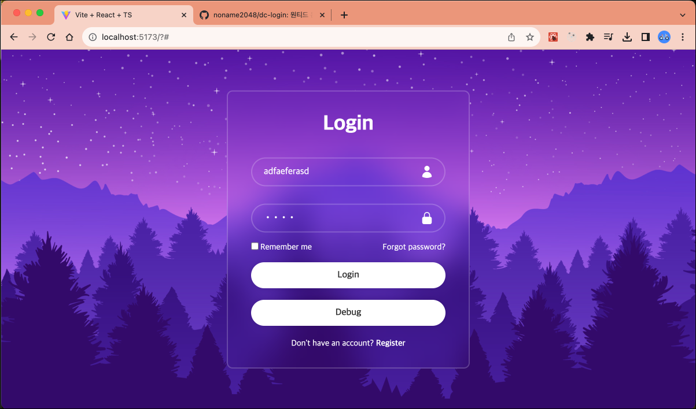

# React + TypeScript + Vite + Login

프리온보딩 과정에 참여하며 배운 내용을 적용시켜 봅니다.

\#React #TS #Vite #Tailwindcss

## 스타일링

스타일링은 다음 리소스를 따라하였습니다. [https://www.youtube.com/watch?v=hlwlM4a5rxg](https://www.youtube.com/watch?v=hlwlM4a5rxg)

## 1주차

1. Login Mock API 를 구현
2. Router 를 Login 상태에 따라 제어
3. Generative Layout (slot 패턴) 이용하기
